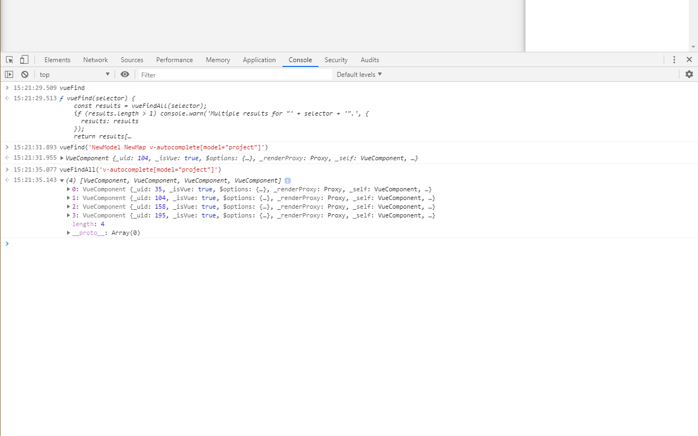

# Vue.js find components

Extension for automating/debugging of Vue.js applications. For most debugging purposes `Vue.js devtools`
are great. This extension supplements them by adding a global `vueFind` function for accessing components
 by selector, instead of clicking through devtools to get `$vm0`.

## Usage:

```js
window.vueFind ~= querySelector for VDOM
window.vueFindAll ~= querySelectorAll for VDOM
```

Instead of manually searching for a component in devtools every time, run
```js
$vm0 = window.vueFind('Card CardDialog[model=isCardDialogVisible]')`
```
(and maybe even make a bookmarklet out of it)


- Simple selectors:

    `window.vueFind('missing')` prints a warning with a tree of supported selectors

- Attribute selectors:

    only `[attr=fullvalue]` and `[attr="full value"]` operators are supported

- Combinators:

    simple selectors can only be combined with a descendant combinator (a space)


## Install

Chrome https://chrome.google.com/webstore/detail/vuejs-find-components/cpghcnolkpibahdpidfopplkdmckpcck

Firefox https://addons.mozilla.org/en-US/firefox/addon/vue-js-find-components/

## Development

    npm install
    npm run dev chrome
    npm run dev firefox
    npm run dev opera
    npm run dev edge

## Build

    npm run build chrome
    npm run build firefox
    npm run build opera
    npm run build edge

## Screenshot


